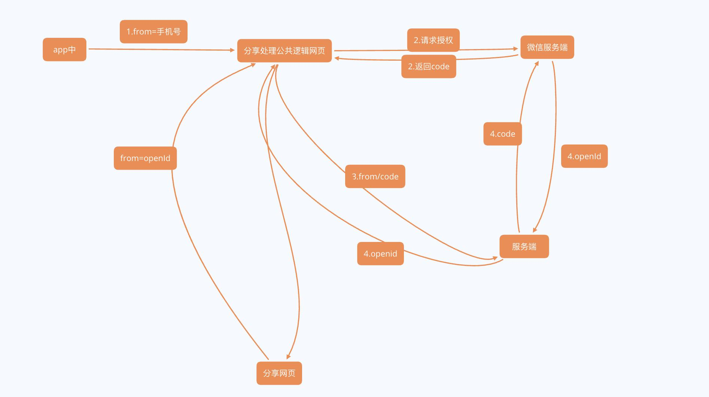

微信网页授权

1.app文章分享至微信,参数携带用户手机号或随机生成一个UUID（from）

2.分享公共处理页面(page)向微信服务端(wxServer)请求授权，微信授权成功redirect至分享公共处理页面(page)，携带code返回

3.公共处理页面(page)向服务端(myServer)发送请求，request(from,code)

4.此时，服务端(myServer)向微信服务端(wxServer)请求拿到code对应的openId,

返回response(code对应的openId)

5.网页自定义分享信息，将openId存入链接

参考文档

微信网页授权官方文档：https://mp.weixin.qq.com/wiki?t=resource/res_main&id=mp1421140842

自定义分享

运营：申请公众号，申请接口权限，配置接口安全域名，下载mp校验文件

后台：mp校验文件放置接口安全域名根目录下，维护access_token

前端：引入jssdk，请求后台拿到appId(公众号的唯一标识)，timestamp(生成签名的时间戳)，nonceStr(生成签名的随机串)，signature(签名)；然后wxConfig，wxReady

参考文档

微信JS-SDK说明文档：https://mp.weixin.qq.com/wiki?t=resource/res_main&id=mp1421141115